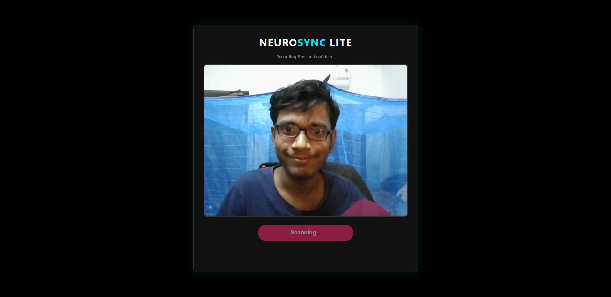
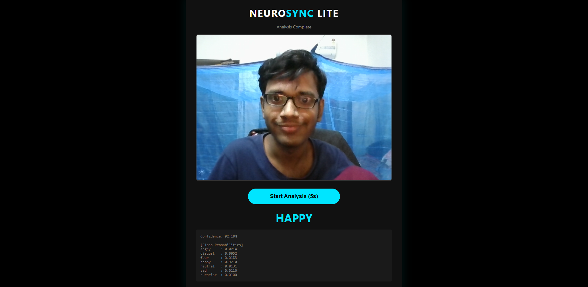

# NeuroSync: Multimodal Emotion Recognition System

> **A real-time AI framework that fuses Computer Vision and Audio Signal Processing to detect human emotions with high fidelity.**


---

## Overview

Standard emotion detection systems often fail in real-world scenarios: video models struggle in low light, and audio models fail in silence.

**NeuroSync** solves this using a **Deep Fusion Architecture**. It integrates temporal auditory features (via **Wav2Vec2**) and spatial visual features (via **EfficientNet**) using a **Cross-Attention mechanism**. The system is robust to sensor failure, automatically prioritizing the most reliable modality (e.g., ignoring video if the camera is covered).

### Key Features
*   **Real-Time Inference:** <200ms latency on consumer hardware (GTX 1650/CPU).
*   **Deep Fusion:** Uses a Transformer-based fusion layer to weigh audio vs. visual cues.
*   **Robustness:** Trained with **Modality Dropout** to handle missing audio or video inputs gracefully.
*   **Lightweight Interface:** Minimalist Flask-based UI for easy testing and demonstration.

---

## System Architecture

The model uses a **Late-Intermediate Fusion** strategy:

1.  **Audio Stream:** **Wav2Vec2-Large-XLS-R** (Frozen) extracts prosody and tone.
2.  **Video Stream:** **HSEmotion (EfficientNet-B0)** (Frozen) extracts facial micro-expressions.
3.  **Fusion Layer:** A **Multi-Head Cross-Attention** block projects both streams to a 512-dimensional latent space to determine the final emotion.

---

## Installation & Setup

### 1. Clone the Repository
```bash
git clone https://github.com/yourusername/NeuroSync.git
cd NeuroSync
```

### 2. Create Virtual Environment
```bash
python -m venv venv
# Windows
.\venv\Scripts\activate
# Mac/Linux
source venv/bin/activate
```

### 3. Install Dependencies
**Crucial:** This project requires specific versions of PyTorch and Timm to avoid version conflicts.
```bash
pip install -r requirements.txt
```

### 4. Download Model Weights (Required)
The model file is too large for GitHub (1.2GB). You must download it from Hugging Face.

1.  **Download Link:** [NeuroSync Fusion Model (last_checkpoint.pth)](https://huggingface.co/SumitPaul/neurosync-multimodal-fusion/blob/main/last_checkpoint.pth)
2.  **Rename the file** from `last_checkpoint.pth` to **`model.pth`**.
3.  **Move the file** to the root directory of this project (next to `app.py`).

---

## Usage

To run the inference server locally:

```bash
python app.py
```

1.  Open your browser to `http://127.0.0.1:5000`.
2.  Allow Camera & Microphone permissions.
3.  Click **"Start Analysis"**.
4.  The system will record a 5-second sample and output the predicted emotion along with confidence scores for all 7 classes.

---

## Performance

The model was trained on the combined **RAVDESS** and **CREMA-D** datasets (~12,000 clips).

*   **Accuracy (4-Class):** ~88% (Happy, Sad, Angry, Neutral)
*   **Accuracy (7-Class):** ~75% (Including Fear, Disgust, Surprise)
*   **Inference Speed:** ~0.15s on GPU / ~0.8s on CPU.

---
## Demo Preview

| **Live Scanning Phase** | **Analysis & Fusion Result** |
|:---:|:---:|
|  |  |
| *Real-time face tracking & audio sampling* | *Deep Fusion detects "Happy" with 92% confidence* |
---
*Built with PyTorch, Flask, and Hugging Face Transformers.*
